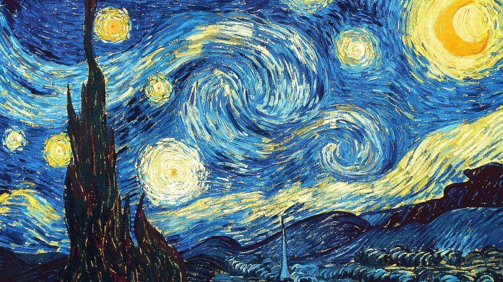
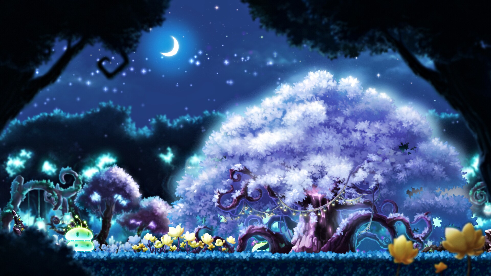
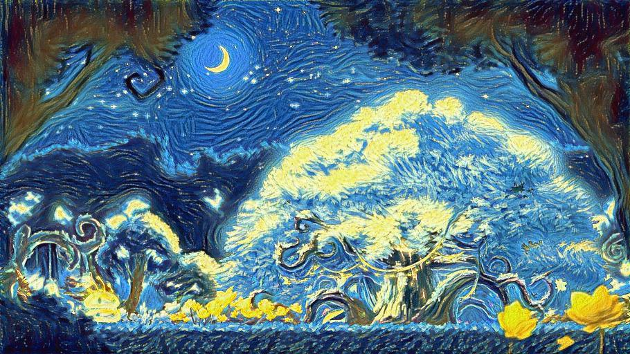

# Pytorch Neural Style Transfer

Basic neural style transfer implementation based on below paper 

[Image Style Transfer Using Convolutional Neural Networks](https://www.cv-foundation.org/openaccess/content_cvpr_2016/papers/Gatys_Image_Style_Transfer_CVPR_2016_paper.pdf)

#### Style Image

Vincent van Gogh - The Starry Night

#### Content Image

Maplestory - Arcana, The Mysterious Forest

#### Styled Content Image

Maplestory - Arcana, The Mysterious Forest with style from Vincent van Gogh - The Starry Night